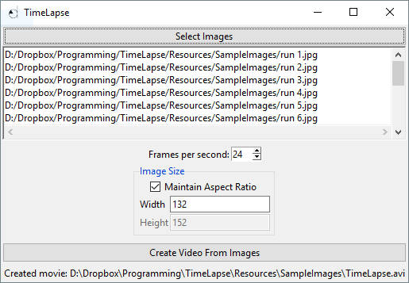

TimeLapse
=========
Utility to create a time lapse movie from a series of images.



Platform Support
----------------
Currently only Windows is supported.  Mac support is in progress.

Usage
-----
 0. Install dependencies.
     1. `pip install --requirement requirements.txt`
     2. _(Windows-only)_ `pip install --requirement requirements-win.txt`
 1. Run CreateTimeLapse.py.
 2. Click the "Select Images" button to select the images to use.
 3. _(optional)_ Choose a frame rate.  Note that the video encoding has trouble below 10 frames-per-second.
 4. _(optional)_ Choose the video resolution.  If none is specified, the image resolution is used.
 5. Click the "Create Video From Images" button.
 6. View the created movie in the input-image directory.

Dependencies
------------
##### Bundled with TimeLapse:
 * mencoder (Part of the mplayer suite: www.mplayerhq.hu)

##### Not Bundled
 * Python 3 (<= 3.4, see cx_Freeze requirement)
 * [cx_Freeze](https://pypi.python.org/pypi/cx_Freeze): at the moment (version 4.3.4) does not support Python 3.5 or greater.
    * _(Windows-only)_ [pywin32](http://sourceforge.net/projects/pywin32/)

Create Standalone Executable
----------------------------
 1. Install [cx_Freeze](https://pypi.python.org/pypi/cx_Freeze).
 2. Update CreateExecutable.py with the path to your Python installation directory.
 3. Run ```CreateExecutable.py build.```.
 4. The output will be under ```./build/```.
 5. Optionally zip the output up and send to users.
